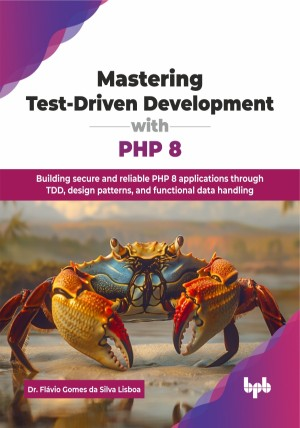

# Mastering Test-Driven Development with PHP 8

Building secure and reliable PHP 8 applications through TDD, design patterns, and functional data handling.

This is the repository for [Mastering Test-Driven Development with PHP 8
](https://bpbonline.com/products/mastering-test-driven-development-with-php-8?variant=44639415435464),published by BPB Publications.

## About the Book
In today's fast-paced development landscape, ensuring code quality and bug-free software through testing is essential. This book is your practical guide to mastering test-driven development (TDD) in the PHP 8 ecosystem, empowering you to write better code from the very beginning.

Embark on a structured learning journey, starting with setting up your PHP 8 testing environment and understanding the core principles of TDD using PHPUnit and Composer. You will then learn about writing tests for fundamental PHP concepts, including functions, file system operations, array handling, and web interactions like forms and sessions. Through the practical exercise of building a book registration application, you will learn to apply TDD with different data storage solutions, from simple file systems to relational databases (MySQL) and document databases (MongoDB). Progressing further, you will discover how to implement TDD in object-oriented PHP 8, covering design patterns, database interactions with PDO, API development, and even exploring testing considerations for security, authentication, and authorization.

By the end of this book, you will possess the skills and confidence to implement TDD effectively in your PHP 8 projects. This book equips you with the skills to write cleaner, more maintainable code, and ultimately leads to more stable and maintainable applications, making you a highly competent PHP 8 developer.

## What You Will Learn
• The foundations of PHP programming and TDD.

• Master core PHP 8 syntax, functions, and web handling.

• Create applications based on SQL and NoSQL databases.

• Apply PHP 8 OOP, design patterns, PDO, and REST API basics.

• Abstract storage, secure code, and implement authentication/authorization.
